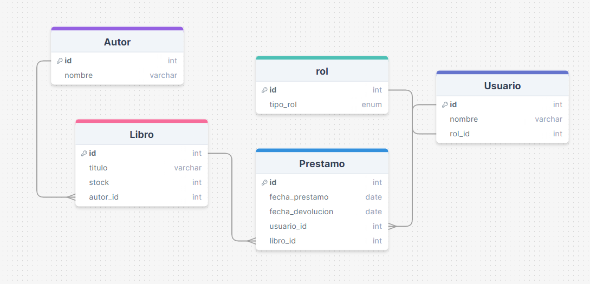

# Enunciado del Proyecto: Sistema de Gestión de Biblioteca

Desarrolla un sistema de gestión de biblioteca que permita administrar los libros, autores, usuarios y préstamos. El sistema debe permitir realizar las siguientes operaciones:

Gestión de Libros:

Crear, editar y eliminar libros.
Asociar libros con autores.
Registrar la disponibilidad de libros (disponibles, prestados, reservados).
Gestión de Autores:

Crear, editar y eliminar autores.
Listar todos los libros de un autor específico.
Gestión de Usuarios:

Crear, editar y eliminar usuarios (bibliotecarios y clientes).
Registrar usuarios con roles específicos (administrador, bibliotecario, cliente).
Gestión de Préstamos:

Registrar préstamos de libros a usuarios.
Gestionar la devolución de libros prestados.
Notificar vencimientos de préstamos pendientes.
El sistema debe cumplir con los siguientes requisitos técnicos:

## Utilizar Laravel 11 como framework backend.
Implementar Vue 3.js para la interfaz de usuario.
Utilizar un ORM (por ejemplo, Eloquent ORM de Laravel) para la interacción con la base de datos.
Ser modular y escalable para permitir la integración futura de Pinia u otro estado global para la gestión del estado de la aplicación.
El objetivo es desarrollar un CRUD (Crear, Leer, Actualizar, Eliminar) para al menos cuatro tablas principales (Libros, Autores, Usuarios y Préstamos), asegurando una arquitectura robusta y mantenible que pueda ampliarse en el futuro con funcionalidades adicionales como la gestión avanzada de estado con Pinia.

# estructura del diseño inicial

